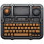
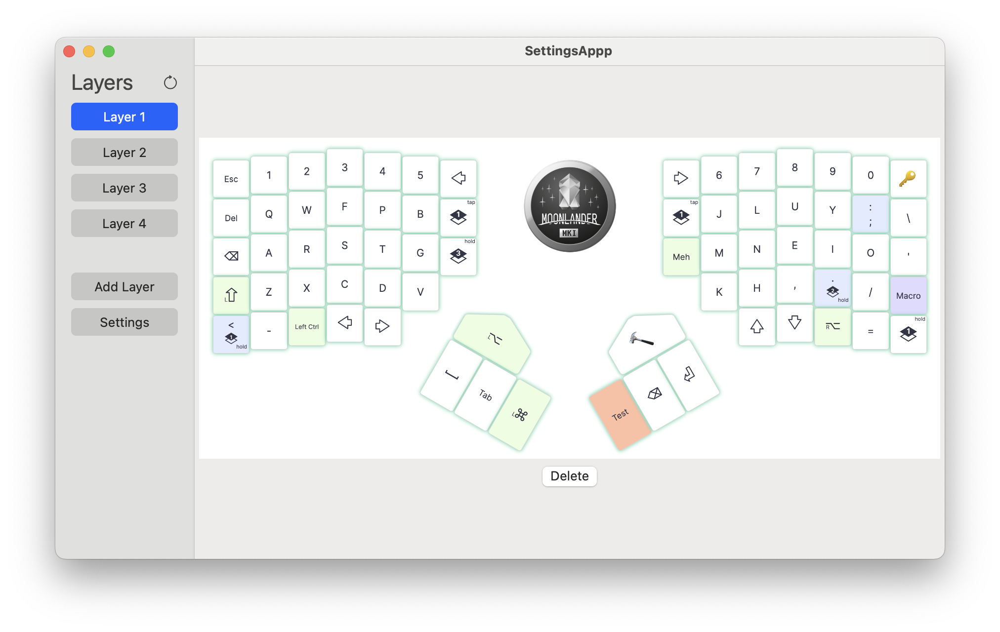
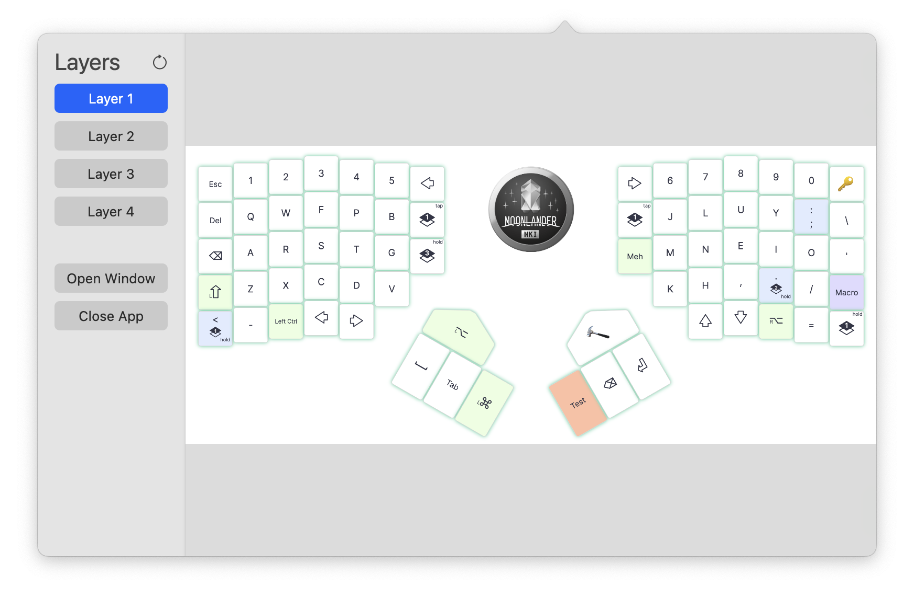

# LayoutGuide 

This App helps you to learn your custom keyboard layout!
You don't want to print the layout every time you changed it? With this app you can look at the layout even quicker,

Just create a shortcut to look at the layout, quick and easy. 

## Licence
 
This code is writen and owened by Veit Progl and all rights to copy, modify and publish versions of this code belong to him. You can use this code for your own projects but you are not allowed to publish this code in any way. If you want to use this code in a public or commercial project please contact me under "voxels@gmx.de"
